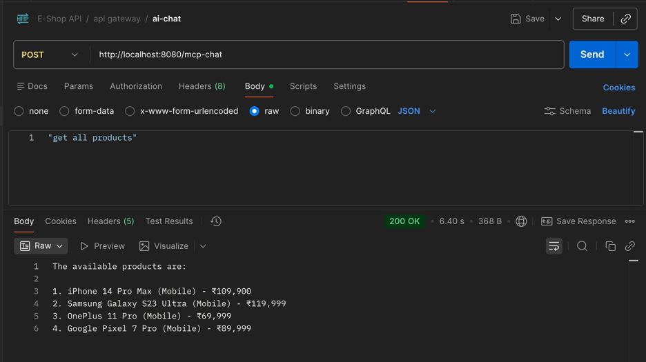

# To run this project smoothly, you need follow the steps below
- Install ollama on your local machine, and run the command ```ollama run llama3.2:latest``` to start the ollama server. It will download the ollama model and start the server in local. You can check the status of the server by running ```ollama list```, it should show you the llama3.2:latest model is running.
- run mcpserverdemo main application first then run the aiagentdemo main application. Since aiagentdomo as the mcp client need to get all the tools that the mcp server initialize.
- run http://localhost:8080/mcp-chat with request body as String. refer to 
- That's it. Thanks for reading to here. Enjoy.
